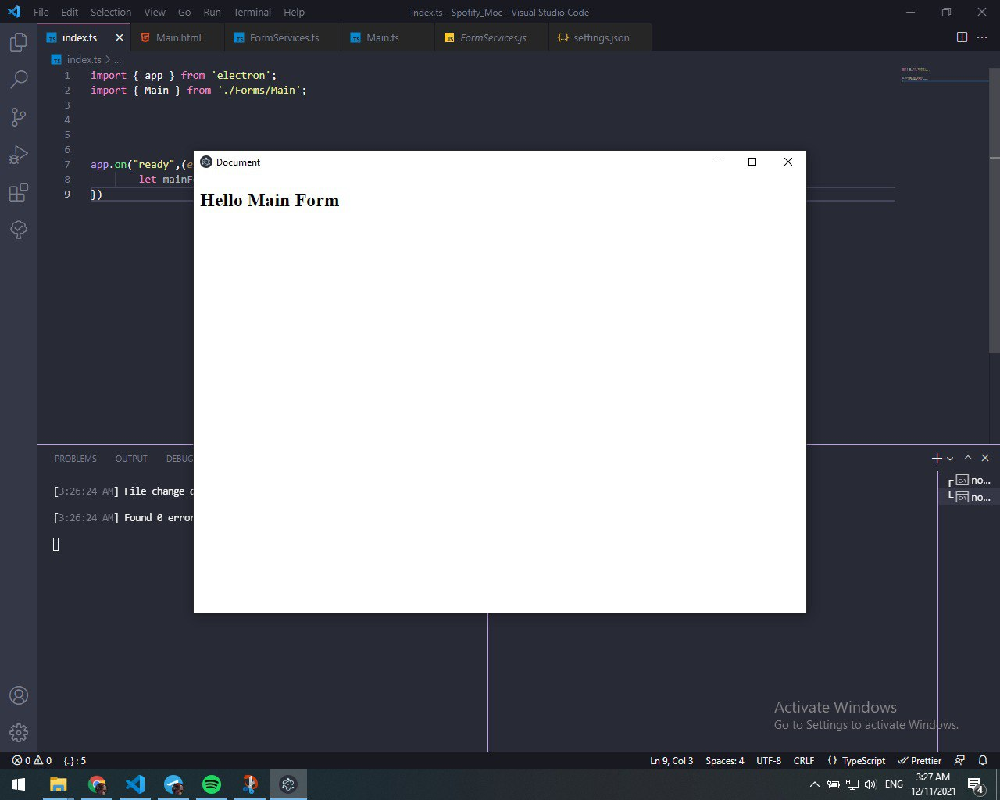
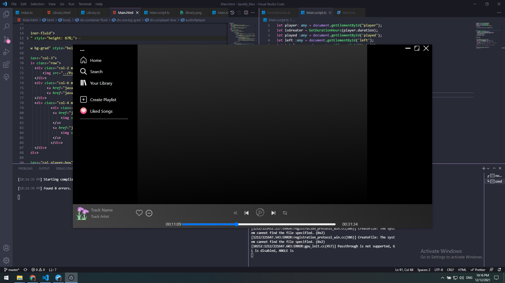
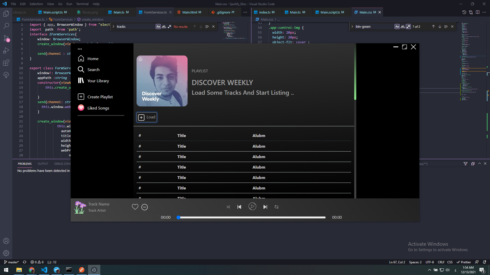
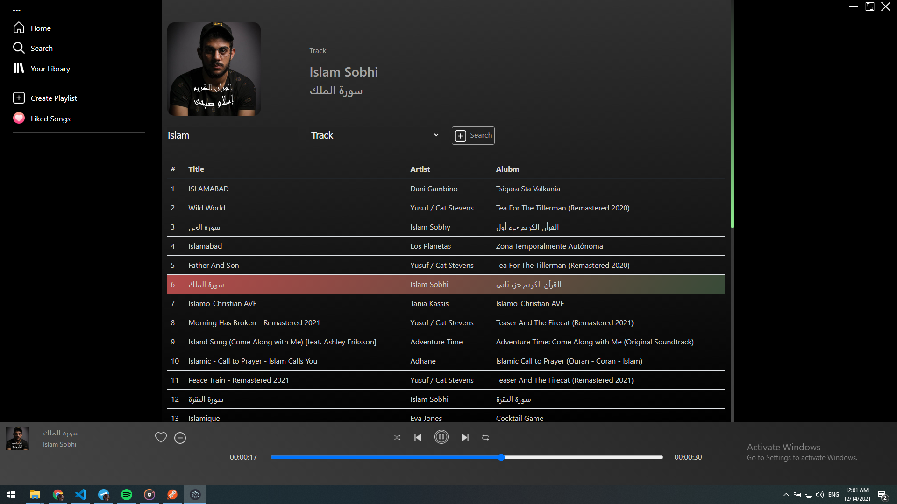
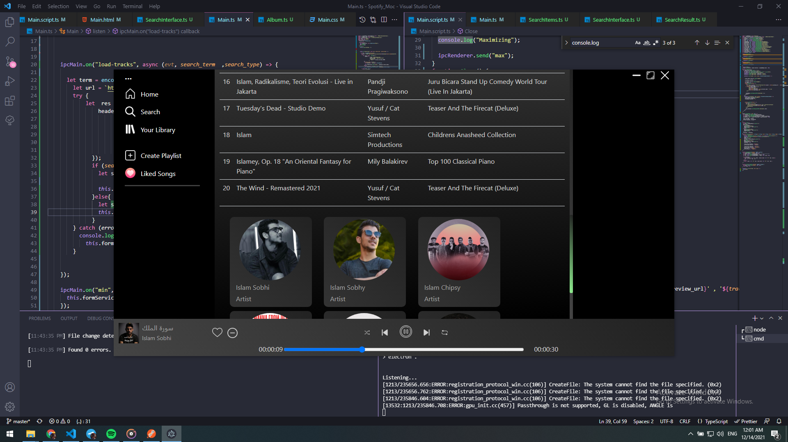
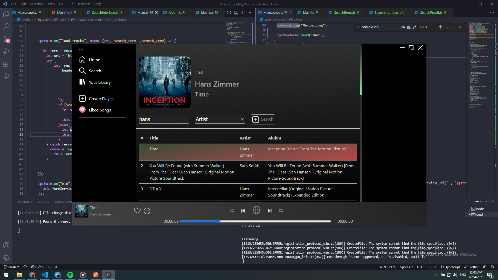

# Build Spotify Clone Using Electron With  Typescript

**version 2.0.0**
---
### Building Structure

### Adding Spotify Main Window

### Adding Content To Main Window

### After Adding Spotify Web Api

--- 
## Note 
### To run this project you need  : 
####  first to run **npm install**  to install required packages for the project
####  second run **tsc -w**  to compile ts into js code 
#### Generate Bearer Spotify web Token At **https://developer.spotify.com/console/get-search-item/** then  put it .env  Brear_TOKEN variable
#### lastly run **npm start**   to run the project

---
## License & copyrights

### Ahmed Seada © 2021
### All Icons Used in the project copyrighted to flaticon.com ©